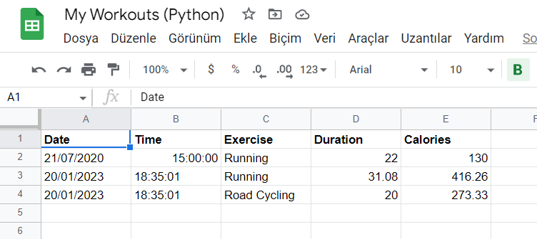

# Workout_Tracker
I go to GYM 4 days in a week but sometimes, I cannot remember what did I do previous workout. That's why, I design this project. 
This project stored your workout in a excel file.

 
